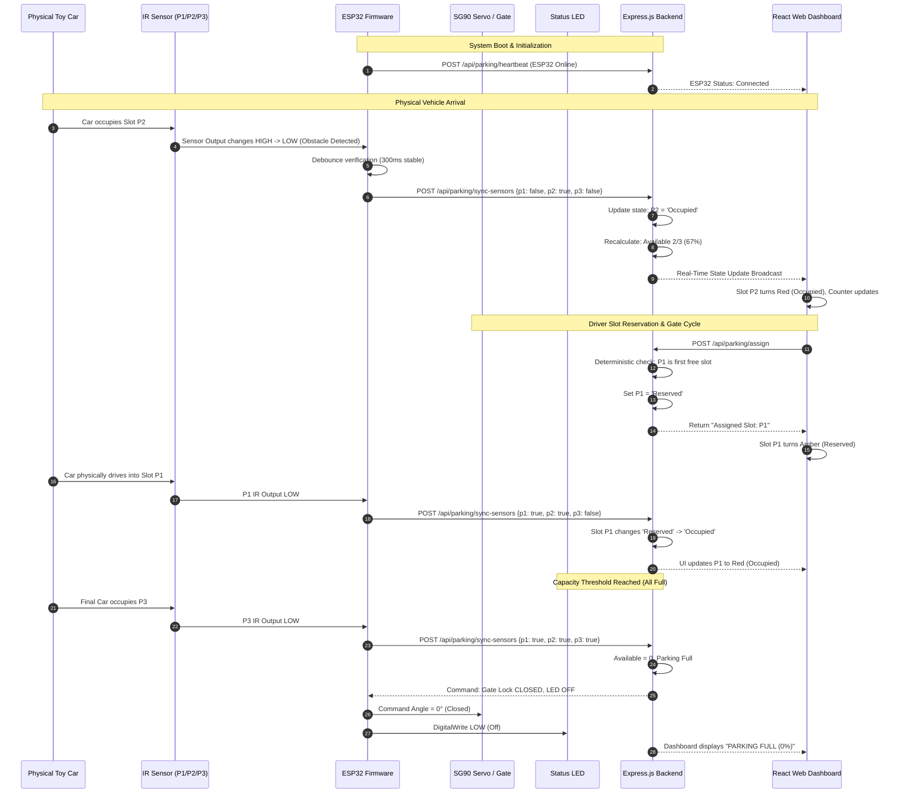
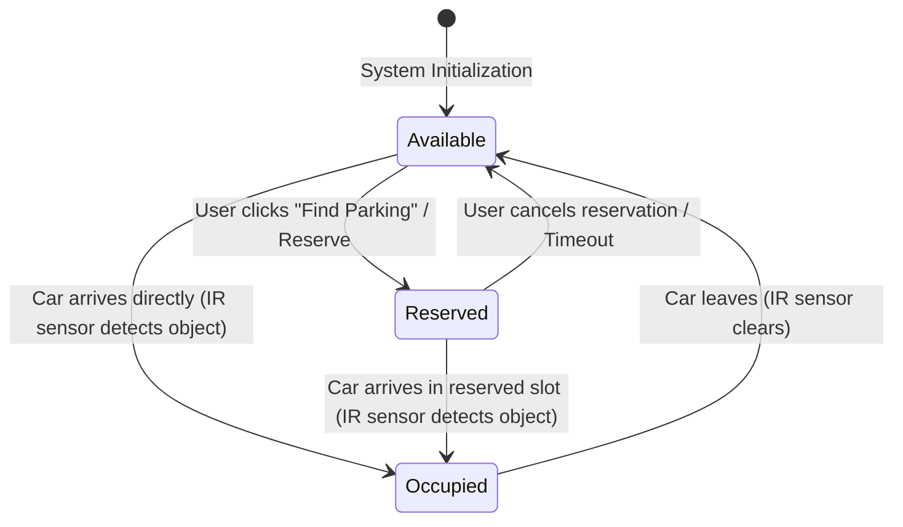

# Product Requirements Document (PRD)
# IoT Smart Parking System (3-Slot Prototype)

* **Project Name:** Smart Parking System
* **Target Environment:** College Project / IoT Capstone Demonstration
* **Version:** 1.0.0
* **Status:** Ready for Implementation
* **Document Owner:** IoT Engineering Team

---

## 1. Project Overview

The **Smart Parking System** is an Internet-of-Things (IoT) prototype designed to solve real-world urban parking congestion on a demonstration scale. It integrates an ESP32 microcontroller, three physical active-low Infrared (IR) obstacle sensors, a micro servo barrier motor, and a central status LED with a full-stack web application (Node.js/Express backend and React/Vite/Tailwind frontend).

The prototype models a single-level parking lot with **3 dedicated parking slots: P1, P2, and P3**. Physical occupancy is monitored continuously by the IR sensors. The live status is broadcast through local Wi-Fi to a web dashboard where users can view slot availability, receive automatic slot assignments, reserve spaces, and observe the entrance gate's automated behavior.

```
+------------------+         Wi-Fi / HTTP POST          +-------------------+
|  ESP32 Hardware  | ---------------------------------> |  Node.js Backend  |
|  - 3x IR Sensors |                                    |  (Express Server) |
|  - 1x SG90 Servo | <--------------------------------- +---------+---------+
|  - 1x Status LED |         HTTP State/Commands                  | Server-Sent Events
+------------------+                                              | or Polling
                                                                  v
                                                        +-------------------+
                                                        |  React Dashboard  |
                                                        |  (Live UI & User) |
                                                        +-------------------+
```

---

## 2. Problem Statement

Drivers in urban commercial centers, university campuses, and hospitals waste significant time and fuel searching for vacant parking bays. Conventional parking setups suffer from:
1. **Lack of Real-Time Visibility:** Drivers do not know if vacant bays exist before driving through aisles.
2. **Blind Entry:** Vehicles queue at entrances even when lots are completely full.
3. **Inefficient Manual Routing:** Drivers circle randomly rather than being directed directly to the closest vacant bay.

Existing industrial systems (ANPR cameras, magnetic loop detectors) are too costly and complex for small institutions. This project demonstrates a lightweight, reliable, and cost-effective IoT alternative combining physical sensor detection with web-based assignment and automated barrier control.

---

## 3. Objectives

* **Accurate Physical Detection:** Reliably detect the presence/absence of vehicles in slots P1, P2, and P3 using calibrated IR obstacle sensors.
* **Synchronized Web Visualization:** Reflect physical vehicle placement or removal on a web dashboard within < 1 second without requiring manual browser refreshes.
* **Deterministic Slot Assignment:** Provide an intelligent, automated assignment mechanism that allocates available slots without conflicts.
* **Automated Entrance Regulation:** Dynamically operate a barrier gate (SG90 servo motor) and a master lot indicator LED based on current parking capacity.
* **Demonstration Reliability:** Deliver an end-to-end working system using minimal, standard hardware that can be set up and presented within minutes in a classroom or lab environment.

---

## 4. Target Users

| User Persona | Context | Needs |
| :--- | :--- | :--- |
| **Driver / Student / Visitor** | Accessing the parking facility via mobile or terminal. | Quick view of total available spaces, ability to trigger automatic slot assignment or reserve a slot ahead of time. |
| **Parking Administrator / Evaluator** | Monitoring facility operations and hardware health. | Live telemetry, verification of ESP32 connection status, real-time activity log, and visual hardware-software parity. |

---

## 5. Hardware Requirements

To guarantee quick assembly and zero component bloat, the bill of materials (BOM) is strictly restricted to the following items:

| Item | Component Specification | Quantity | Role & Placement |
| :---: | :--- | :---: | :--- |
| 1 | **ESP32 NodeMCU Development Board** (30/38 pin) | 1 | Master micro-controller with 2.4 GHz Wi-Fi. |
| 2 | **IR Obstacle Sensor Modules** (Active-Low) | 3 | Mounted at the head of slots P1, P2, and P3. |
| 3 | **SG90 Micro Servo Motor** (9g) | 1 | Entrance barrier gate arm (0° = closed, 90° = open). |
| 4 | **5mm Plain Red or Green LED** | 1 | Overall lot occupancy indicator at the entrance. |
| 5 | **220Ω Resistor** (1/4W) | 1 | Current limiting resistor for the LED. |
| 6 | **Solderless Breadboard** (830 or 400 tie-point) | 1 | Hardware interconnect and common power rails. |
| 7 | **Jumper Wires** (Male-to-Male, Male-to-Female) | ~20 | Circuit interconnections. |
| 8 | **5V Power Supply / USB Power Bank** (>= 2A) | 1 | Provides clean 5V DC power to ESP32, servo, and sensors. |
| 9 | **Cardboard / Foam Core Board** | 1 | Base platform for 3 parking slots, lanes, and gate. |
| 10 | **Toy Cars / Die-cast Models** | 3 | Physical demonstration vehicles. |

### Explicitly Excluded Hardware
* Arduino boards, ultrasonic sensors (HC-SR04), RFID modules (RC522), I2C LCD/OLED displays, buzzers, cameras (ESP32-CAM), GPS, and extra servos.

---

## 6. Software Requirements

### 6.1 Embedded Firmware
* **Platform:** Arduino IDE or PlatformIO (C/C++ framework).
* **Libraries:**
  * `WiFi.h` (ESP32 Core built-in)
  * `HTTPClient.h` (ESP32 Core built-in)
  * `ESP32Servo.h` (Servo control on ESP32 PWM pins)
  * `ArduinoJson.h` (Version 6.x / 7.x for payload serialization)

### 6.2 Backend Server
* **Runtime:** Node.js (v18+ LTS)
* **Framework:** Express.js
* **Middleware & Tools:**
  * `cors` (Cross-Origin Resource Sharing for dev environments)
  * `dotenv` (Environment configurations)
* **Storage:** In-memory application state (no SQL/NoSQL database overhead required for the prototype).

### 6.3 Frontend Application
* **Framework:** React 18+ bootstrapped with Vite
* **Styling:** Tailwind CSS
* **Icons:** Lucide React (`Car`, `ShieldCheck`, `AlertCircle`, `Wifi`, `WifiOff`, `CheckCircle2`, etc.)
* **Communication:** Fetch API / Axios with periodic background polling (e.g., every 800ms) or Server-Sent Events (SSE).

---

## 7. System Architecture

```
+------------------------------------------------------------------------------------+
|                                 PHYSICAL LAYER                                     |
|                                                                                    |
|   +----------------+   +----------------+   +----------------+                     |
|   | IR Sensor 1    |   | IR Sensor 2    |   | IR Sensor 3    |                     |
|   | (Slot P1)      |   | (Slot P2)      |   | (Slot P3)      |                     |
|   +-------+--------+   +-------+--------+   +-------+--------+                     |
|           |                    |                    |                              |
|           v (GPIO 13)          v (GPIO 12)          v (GPIO 14)                    |
|       +----------------------------------------------------+                       |
|       |             ESP32 Microcontroller                  |                       |
|       |  - Digital Debounce Filter                         |                       |
|       |  - Servo Controller (GPIO 18)                      |                       |
|       |  - Master LED Controller (GPIO 2)                  |                       |
|       +--------------------------+-------------------------+                       |
|                                  |                                                 |
+----------------------------------|-------------------------------------------------+
                                   | Wi-Fi (IEEE 802.11 b/g/n)
                                   v
+------------------------------------------------------------------------------------+
|                              APPLICATION LAYER                                     |
|                                                                                    |
|       +----------------------------------------------------+                       |
|       |             Node.js / Express Backend              |                       |
|       |  - In-Memory Parking State Matrix                  |                       |
|       |  - Slot Allocation & Reservation Engine            |                       |
|       |  - RESTful APIs (`/api/parking/*`)                 |                       |
|       +--------------------------+-------------------------+                       |
|                                  |                                                 |
|                                  | JSON over HTTP / SSE                            |
|                                  v                                                 |
|       +----------------------------------------------------+                       |
|       |             React + Vite Web Dashboard             |                       |
|       |  - Live 3-Slot Visual Parking Grid                 |                       |
|       |  - Capacity Metrics (% Available, Occupied, Free)  |                       |
|       |  - One-Click Slot Assignment & Reservation Modal   |                       |
|       |  - Hardware Heartbeat & Live Activity Feed         |                       |
|       +----------------------------------------------------+                       |
+------------------------------------------------------------------------------------+
```

---

## 8. Hardware-to-Software Data Flow



---

## 9. Core Features

1. **3-Point Physical IR Telemetry:** Discrete optical detection of slot presence using active-low IR obstacle modules with onboard sensitivity potentiometers.
2. **Dynamic 3-Slot Web Visualization:** Intuitive graphical representation of slots P1, P2, and P3 displaying unambiguous status cues and colors.
3. **Automated Slot Assigner:** A single-action "Find Parking" recommendation engine that instantly calculates and locks the optimal vacant slot.
4. **Direct Slot Reservation:** Enables drivers to reserve an available bay on demand.
5. **Physical-Sensor Verification Bridge:** Seamless state promotion from `Reserved` to `Occupied` upon optical vehicle detection.
6. **Automated Entry Barrier Control:** Micro-servo arm that raises when space exists and locks shut when capacity is exhausted.
7. **Single-LED Capacity Beacon:** Binary physical visual indicator mounted at the entry (Lit = Spaces Open, Dark = Lot Full).
8. **Heartbeat & Connectivity Watchdog:** Proactive monitoring of the ESP32 connection state with automatic failover alert on the web UI.

---

## 10. Functional Requirements

### 10.1 Hardware Functional Requirements
* **FR-HW-01:** The ESP32 shall read the digital outputs of IR sensors 1, 2, and 3 every 100 milliseconds.
* **FR-HW-02:** The ESP32 shall apply a software debounce threshold of 300 milliseconds to eliminate optical jitter caused by hand movements or reflections.
* **FR-HW-03:** The ESP32 shall drive the SG90 servo to 90° (Gate Open) when permitted by the backend, and return it to 0° (Gate Closed) after entry or when the lot is full.
* **FR-HW-04:** The ESP32 shall drive the overall status LED HIGH when $\text{Available Slots} \ge 1$, and LOW when $\text{Available Slots} = 0$.

### 10.2 Backend Functional Requirements
* **FR-BE-01:** The backend shall maintain the single source of truth for the lot state in-memory.
* **FR-BE-02:** The backend shall accept sensor status updates from the ESP32 via `POST /api/parking/sync-sensors`.
* **FR-BE-03:** The backend shall provide a slot assignment endpoint `POST /api/parking/assign` that deterministically picks the lowest indexed available slot.
* **FR-BE-04:** The backend shall reject assignment/reservation requests when all slots are occupied or reserved with an HTTP 409 Conflict code.
* **FR-BE-05:** The backend shall flag the ESP32 as "Disconnected" if no sync/heartbeat payload is received within a rolling window of 5 seconds.

### 10.3 Frontend Functional Requirements
* **FR-FE-01:** The dashboard shall display the 3 parking bays with distinctive labels (P1, P2, P3) and explicit state badges.
* **FR-FE-02:** The dashboard shall display aggregate lot metrics: Total Slots (3), Available Slots, Occupied Slots, Reserved Slots, and Availability Percentage.
* **FR-FE-03:** The dashboard shall offer a prominent "Find Parking" / "Reserve Slot" interactive trigger.
* **FR-FE-04:** The dashboard shall render an activity log showing the 5 most recent timestamped state changes.
* **FR-FE-05:** The dashboard shall display an active connection badge showing "ESP32 Connected" (Green) or "ESP32 Disconnected" (Red).

---

## 11. Slot State Logic

Each of the three parking slots (P1, P2, P3) exists in exactly one of three states at any given moment:

| State | Color Code | Physical IR Reading | Meaning | Transition Rules |
| :--- | :--- | :--- | :--- | :--- |
| **Available** | Emerald Green (`#10B981`) | HIGH (No obstacle) | Bay is vacant and open to any vehicle. | Transitions to **Reserved** via user booking, or directly to **Occupied** if a car parks unreserved. |
| **Reserved** | Amber Yellow (`#F59E0B`) | HIGH (No obstacle yet) | Bay has been allocated by the web system; awaiting arrival. | Transitions to **Occupied** when physical car enters bay, or back to **Available** if canceled/timed out. |
| **Occupied** | Rose Red (`#EF4444`) | LOW (Obstacle detected) | A physical vehicle is present in the bay. | Transitions to **Available** only when the car physically leaves and the IR sensor returns to HIGH. |

### Finite State Machine (Per Slot)



---

## 12. Automatic Slot Assignment Logic

When a driver taps the **"Find Parking"** button:
1. **Fetch Latest State:** The system interrogates the slot status array `[P1, P2, P3]`.
2. **Filter Candidates:** Only slots where `status === 'Available'` are eligible. Slots marked `Occupied` or `Reserved` are strictly disqualified.
3. **Deterministic Selection:** Select the lowest numbered slot (P1 has priority over P2, and P2 over P3) to optimize parking flow.
4. **Atomic State Mutation:**
   * Set selected slot `status = 'Reserved'`.
   * Log an event: `"Slot Px automatically assigned to driver."`
5. **Payload Response:** Return JSON containing the assigned slot name and timestamp.
6. **Edge Case Handling:** If no slots are available, return an immediate message: `"Parking Full - No slots available"`.

```javascript
// Reference backend assignment algorithm
function assignAvailableSlot(slots) {
  const candidate = slots.find(slot => slot.status === 'Available');
  if (!candidate) {
    return { success: false, message: 'Parking Full - No available slots.' };
  }
  candidate.status = 'Reserved';
  candidate.reservedAt = new Date().toISOString();
  return { success: true, assignedSlot: candidate.id };
}
```

---

## 13. Reservation Logic

1. **Explicit Selection vs. Quick Reserve:**
   * **Quick Reserve:** Functions identically to the "Find Parking" flow.
   * **Specific Slot Reserve:** Users may click directly on an `Available` slot on the map.
2. **Verification Guard:** If a user attempts to reserve a slot that is already `Occupied` or `Reserved`, the UI immediately disables the button or returns a toast notification: `"Slot is no longer available"`.
3. **Occupancy Confirmation:** Once a slot is in `Reserved` state, the system waits for the physical vehicle to pull into that slot. The moment the corresponding IR sensor triggers `LOW`, the backend shifts state from `Reserved` to `Occupied`.

---

## 14. Servo / Entrance Gate Logic

The SG90 micro-servo acts as the physical boom barrier at the parking entrance.

* **Closed Position:** $0^\circ$ (Barrier arm horizontal, blocking entry).
* **Open Position:** $90^\circ$ (Barrier arm vertical, allowing passage).

### Barrier Decision Matrix

| Condition | Barrier Action | Servo Position | Explanation |
| :--- | :---: | :---: | :--- |
| $\text{Available Slots} > 0$ and car approaches | Gate Opens | $90^\circ$ | Entry permitted; spaces are vacant. Gate remains open for 3 seconds then returns to $0^\circ$. |
| Manual Gate Open (Dashboard command) | Gate Opens | $90^\circ$ | Admin test override. Returns to $0^\circ$ after 3 seconds. |
| $\text{Available Slots} = 0$ (All 3 Occupied/Reserved) | Gate Locked Closed | $0^\circ$ | Entry denied; prevent lot overflow. |

```cpp
// ESP32 Servo control logic
void updateGate(bool lotFull) {
  if (lotFull) {
    barrierServo.write(0); // Lock barrier horizontal
  } else {
    // Normal ready state: closed until triggered or held open for demonstration
  }
}
```

---

## 15. Availability Calculation

The availability calculation is strictly mathematical and deterministic without stochastic or AI predictions:

$$\text{Available Slots} = \text{Total Slots (3)} - (\text{Occupied Slots} + \text{Reserved Slots})$$

$$\text{Estimated Availability \%} = \left( \frac{\text{Available Slots}}{\text{Total Slots}} \right) \times 100$$

### Discrete Values Table

| Occupied Count | Reserved Count | Available Count | Availability % | System Status | LED State |
| :---: | :---: | :---: | :---: | :--- | :---: |
| 0 | 0 | 3 | **100%** | Open - High Availability | ON |
| 1 | 0 | 2 | **67%** | Open - Moderate Availability | ON |
| 1 | 1 | 1 | **33%** | Open - Low Availability | ON |
| 2 | 0 | 1 | **33%** | Open - Low Availability | ON |
| 3 | 0 | 0 | **0%** | Parking Full | OFF |
| 2 | 1 | 0 | **0%** | Parking Full (Reserved) | OFF |

---

## 16. Frontend Requirements

### 16.1 Layout Specifications
The user interface is designed as a single-page responsive command dashboard optimized for projection during a college presentation.

```
+------------------------------------------------------------------------------------+
|  [P] SMART PARKING SYSTEM                                  ● ESP32 Connected (0.2s)|
+------------------------------------------------------------------------------------+
|  +----------------+  +----------------+  +----------------+  +-------------------+ |
|  | TOTAL SLOTS    |  | AVAILABLE      |  | OCCUPIED       |  | AVAILABILITY %    | |
|  | 3              |  | 2              |  | 1              |  | 67%               | |
|  +----------------+  +----------------+  +----------------+  +-------------------+ |
+------------------------------------------------------------------------------------+
|  LIVE PARKING OCCUPANCY MAP                                                         |
|  +--------------------+  +--------------------+  +--------------------+            |
|  |      SLOT P1       |  |      SLOT P2       |  |      SLOT P3       |            |
|  |  [Car Icon Green]  |  |   [Car Icon Red]   |  |  [Car Icon Green]  |            |
|  |     AVAILABLE      |  |      OCCUPIED      |  |     AVAILABLE      |            |
|  |   [Reserve Bay]    |  |   Sensor Active    |  |   [Reserve Bay]    |            |
|  +--------------------+  +--------------------+  +--------------------+            |
+------------------------------------------------------------------------------------+
|  ACTIONS & CONTROLS                    |  GATE STATUS & ACTIVITY FEED              |
|  [ FIND PARKING / AUTO-ASSIGN ]        |  Gate: [CLOSED (0°)]   [Open Gate (3s)]   |
|                                        |  - 10:14:02: P2 became Occupied           |
|  Your Assigned Slot: [  P1  ]          |  - 10:13:50: P1 marked Available          |
|  Please proceed to entrance gate.      |  - 10:12:10: ESP32 Connected              |
+------------------------------------------------------------------------------------+
```

### 16.2 UI Components & Styling Details
* **Header:** Title with glowing status badge (`bg-emerald-500` for connected, `bg-rose-500` with pulse animation for disconnected). Shows last updated timestamp.
* **Metric Cards:** 4 high-contrast KPI cards styled with subtle border radius and shadow (`rounded-xl p-4 bg-slate-800 text-white`).
* **Visual Parking Bays:** Styled as real road markings:
  * White dashed road dividers.
  * Large bay designation (`P1`, `P2`, `P3`).
  * Dynamic car visual asset: displays empty parking bay or parked vehicle with color-coded outline.
* **Slot Badges:**
  * Available: `bg-emerald-500/10 text-emerald-400 border-emerald-500/30`
  * Reserved: `bg-amber-500/10 text-amber-400 border-amber-500/30`
  * Occupied: `bg-rose-500/10 text-rose-400 border-rose-500/30`
* **Assignment Drawer/Modal:** Prominent highlight showing assigned slot with an animated confirmation checkmark.
* **Activity Stream:** Compact timestamped scroll area listing the last 5 state transitions.

---

## 17. Backend / API Requirements

### 17.1 In-Memory Data Model
```typescript
interface ParkingState {
  slots: {
    id: 'P1' | 'P2' | 'P3';
    status: 'Available' | 'Occupied' | 'Reserved';
    sensorDetected: boolean;
    lastChanged: string;
  }[];
  gate: {
    state: 'Open' | 'Closed';
    lastOperated: string;
  };
  esp32: {
    isOnline: boolean;
    lastHeartbeat: string;
  };
  recentActivity: {
    id: string;
    timestamp: string;
    message: string;
  }[];
}
```

### 17.2 REST API Endpoints

#### 1. `GET /api/parking/status`
* **Description:** Returns the complete state of the parking lot, slot occupancy, gate position, and ESP32 heartbeat.
* **Response (200 OK):**
```json
{
  "totalSlots": 3,
  "availableCount": 2,
  "occupiedCount": 1,
  "reservedCount": 0,
  "availabilityPercentage": 67,
  "gateState": "Closed",
  "esp32Online": true,
  "lastUpdated": "2026-09-12T08:30:00.000Z",
  "slots": [
    { "id": "P1", "status": "Available", "sensorDetected": false },
    { "id": "P2", "status": "Occupied", "sensorDetected": true },
    { "id": "P3", "status": "Available", "sensorDetected": false }
  ],
  "recentActivity": [
    { "timestamp": "08:29:55", "message": "P2 physically occupied by car." }
  ]
}
```

#### 2. `POST /api/parking/sync-sensors`
* **Description:** Sent periodically by the ESP32 to publish real-time IR sensor readings.
* **Request Body:**
```json
{
  "p1": false,
  "p2": true,
  "p3": false
}
```
* **Response (200 OK):**
```json
{
  "success": true,
  "command": {
    "ledState": "ON",
    "gateState": "AUTO"
  }
}
```

#### 3. `POST /api/parking/assign`
* **Description:** Triggers the deterministic auto-assignment algorithm.
* **Response (200 OK):**
```json
{
  "success": true,
  "assignedSlot": "P1",
  "message": "Assigned slot P1 successfully."
}
```
* **Error Response (409 Conflict):**
```json
{
  "success": false,
  "assignedSlot": null,
  "message": "Parking Full - No slots available."
}
```

#### 4. `POST /api/parking/reserve`
* **Description:** User requests to reserve a specific slot (e.g. `{ "slotId": "P3" }`).
* **Response (200 OK):** Updates slot to `Reserved`.

#### 5. `POST /api/parking/gate/trigger`
* **Description:** Demonstrator or driver triggers gate to open for 3 seconds.
* **Response (200 OK):** `{ "success": true, "gateState": "Open" }`.

---

## 18. ESP32 Firmware Requirements

### 18.1 Pin Mapping (ESP32 DevKit v1)

| ESP32 GPIO Pin | Connected Component | Function / Signal | Notes |
| :---: | :--- | :--- | :--- |
| **GPIO 13** | IR Sensor 1 (P1) | Digital Input (Active LOW) | Internal pull-up enabled |
| **GPIO 12** | IR Sensor 2 (P2) | Digital Input (Active LOW) | Internal pull-up enabled |
| **GPIO 14** | IR Sensor 3 (P3) | Digital Input (Active LOW) | Internal pull-up enabled |
| **GPIO 18** | SG90 Servo Signal | PWM Output (50Hz) | Controls gate arm position |
| **GPIO 2** | Overall Status LED | Digital Output (Active HIGH) | In series with 220Ω resistor |
| **5V (VIN)** | Breadboard Power Rail | 5V DC Supply | Powered by USB / 5V Bank |
| **GND** | Breadboard Ground Rail| Common Ground | Shared ground for all modules |

### 18.2 Firmware Architecture & Loop Logic
1. **Setup Phase:**
   * Configure GPIOs 13, 12, 14 as `INPUT_PULLUP`.
   * Configure GPIO 2 as `OUTPUT`.
   * Attach SG90 servo on GPIO 18 and set initial angle to $0^\circ$ (Closed).
   * Connect to local Wi-Fi access point (e.g., mobile hotspot or lab network).
2. **Loop Execution (every 100ms):**
   * Read raw sensor signals: `raw1 = digitalRead(13)`, `raw2 = digitalRead(12)`, `raw3 = digitalRead(14)`.
   * **Active-Low Inversion:** Convert to boolean where `true` means object detected (`!raw`).
   * **Debounce Filter:** Require sensor value to remain constant across 3 consecutive cycles before registering a change.
   * If a state change occurs OR if the 1-second heartbeat interval expires:
     * Construct JSON string: `{"p1": detected1, "p2": detected2, "p3": detected3}`.
     * Transmit HTTP POST payload to `http://<SERVER_IP>:5000/api/parking/sync-sensors`.
     * Parse returned JSON response to update LED state (`digitalWrite(2, ledStatus)`) and servo gate commands.
3. **Resilience & Watchdog:**
   * If Wi-Fi disconnects, the ESP32 attempts auto-reconnect in the background without freezing sensor acquisition.

---

## 19. Physical Prototype Layout

The physical model is built on a rigid rectangular cardboard or foam board base (approx. 40cm × 30cm) to simulate an authentic parking facility:

```
+-------------------------------------------------------------------------------+
|                               PHYSICAL MODEL BASE                             |
|                                                                               |
|   [ENTRANCE ROAD]                                                             |
|          |                                                                    |
|          v                                                                    |
|   [SG90 Barrier Gate]    [Master LED (220Ω)]                                  |
|   (GPIO 18)              (GPIO 2 - Green/Red)                                 |
|          |                                                                    |
|   =======+=================================================================   |
|   DRIVE AISLE / LANE                                                          |
|   -------------------------------------------------------------------------   |
|                                                                               |
|   +-------------------+   +-------------------+   +-------------------+       |
|   | [IR SENSOR 1]     |   | [IR SENSOR 2]     |   | [IR SENSOR 3]     |       |
|   | (Mounted at head) |   | (Mounted at head) |   | (Mounted at head) |       |
|   |                   |   |                   |   |                   |       |
|   |   SLOT P1         |   |   SLOT P2         |   |   SLOT P3         |       |
|   |   [Toy Car 1]     |   |   [Toy Car 2]     |   |   [Toy Car 3]     |       |
|   |                   |   |                   |   |                   |       |
|   +-------------------+   +-------------------+   +-------------------+       |
|                                                                               |
|   -------------------------------------------------------------------------   |
|   [BREADBOARD + ESP32 DEV BOARD]       [5V POWER / USB CONNECTION]            |
|   (Neatly mounted at side/rear)                                               |
+-------------------------------------------------------------------------------+
```

### Layout Notes:
* **Slot Markings:** White electrical tape or white paint pen lines mark the 3 bays (approx. 8cm wide × 14cm long each, fitting standard 1:64 or 1:43 toy cars).
* **IR Sensor Placement:** Mounted vertically at the bumper end of each slot. The emitter and detector LEDs point directly into the bay at bumper height (~1.5cm - 2.5cm off the floor).
* **Sensitivity Tuning:** Calibrate each sensor’s onboard trimmer pot so it reliably triggers when a toy car is parked, but ignores ambient room lighting and empty floor cardboard.
* **Entrance Barrier:** The SG90 servo is mounted beside the access lane with a small cardboard arm attached to the servo horn.
* **Status LED:** Mounted on a small pillar beside the barrier arm, acting as the street-level entrance traffic light.

---

## 20. End-to-End User Flow

```mermaid
flowchart TD
    Start([User opens Web Dashboard]) --> FetchStatus[Dashboard polls /api/parking/status]
    FetchStatus --> Render[Display 3 Slots + Availability %]
    
    Render --> UserChoice{User Action}
    
    UserChoice -->|Click 'Find Parking'| AutoAssign[POST /api/parking/assign]
    AutoAssign --> CheckAvail{Any slot Available?}
    CheckAvail -->|No| ShowFull[Display 'Parking Full' Alert]
    CheckAvail -->|Yes| AssignSlot[Assign lowest index slot e.g., P1]
    AssignSlot --> MarkReserved[Slot status -> Reserved]
    MarkReserved --> DisplaySlot[UI: 'Your Assigned Slot: P1']
    
    DisplaySlot --> DriveIn[User drives toy car to Entrance]
    DriveIn --> GateCheck{Is Lot Full?}
    GateCheck -->|No| OpenGate[Servo opens to 90° for 3 sec]
    GateCheck -->|Yes| KeepClosed[Servo remains locked at 0°]
    
    OpenGate --> ParkCar[Car enters bay P1]
    ParkCar --> IRSense[IR Sensor 1 detects car]
    IRSense --> ESPPost[ESP32 posts sensor update to Backend]
    ESPPost --> StatePromote[Backend changes P1: Reserved -> Occupied]
    StatePromote --> UIReflect[Dashboard updates: P1 = Occupied (Red)]
    UIReflect --> Recalc[Metrics recalculated: Available decremented]
    Recalc --> End([Complete Demo Cycle])
```

---

## 21. Demonstration Scenario

The following scripted sequence is designed for a flawless 3-minute live presentation:

1. **System Boot (0:00 - 0:30):**
   * Power on ESP32 via USB.
   * Start Node.js backend (`npm run dev`) and React frontend.
   * Open the dashboard on a projector or laptop screen.
   * Point out the **"ESP32 Connected"** status indicator and all 3 slots showing **Available (100%)**.
   * Note that the entrance **LED is ON** and the **Barrier Gate is at 0°**.

2. **Physical Car Arrival - Slot P2 (0:30 - 1:00):**
   * Pick up Toy Car #1 and place it into slot **P2**.
   * Within < 1 second, point to the screen: **Slot P2 turns Red (Occupied)**.
   * Availability counter drops from 3 to **2/3 (67%)**.
   * Master LED stays **ON**.

3. **Software-Driven Slot Assignment & Reservation (1:00 - 1:45):**
   * Click **"Find Parking"** on the dashboard.
   * System instantly assigns **P1** (lowest available slot).
   * Slot P1 shifts to **Amber (Reserved)** on screen.
   * Total Available becomes **1/3 (33%)**.

4. **Hardware Verification of Reservation (1:45 - 2:15):**
   * Drive Toy Car #2 through the entrance (servo barrier triggers to 90°).
   * Park Toy Car #2 into slot **P1**.
   * IR Sensor 1 detects the car; P1 turns **Red (Occupied)** on the dashboard.
   * This proves the real-time software-to-hardware binding.

5. **Full Capacity & Gate Lockout (2:15 - 3:00):**
   * Place Toy Car #3 into the final slot **P3**.
   * IR Sensor 3 triggers; P3 turns **Occupied**.
   * Availability drops to **0/3 (0% - Parking Full)**.
   * Show hardware reaction:
     * Entrance **LED turns OFF**.
     * Servo gate remains **firmly locked at 0°**.
   * Click "Find Parking" on UI: System displays **"Parking Full - No slots available"**.
   * Remove Car from P2: System instantly flips back to **1 Available (33%)**, LED turns back **ON**, barrier ready to open.

---

## 22. Error and Edge Cases

| Scenario | Possible Cause | System Response & Mitigation |
| :--- | :--- | :--- |
| **Wi-Fi Dropout** | Router glitch or signal loss. | ESP32 enters non-blocking auto-reconnect loop. Frontend displays `"ESP32 Disconnected"` banner after 5 missed heartbeats. |
| **False Sensor Reflection** | Sunlight or glossy toy car paint. | Hardware: Calibrate trimmer potentiometer. Firmware: Apply 300ms software debounce check before transmitting change. |
| **Drive-in without Reservation** | Car pulls into an `Available` bay directly. | IR sensor detects vehicle; backend immediately sets slot to `Occupied`, bypassing `Reserved`. Metrics update accurately. |
| **Wrong Slot Parked** | User reserved P1, but parked in P3. | IR sensor 3 detects vehicle $\rightarrow$ P3 becomes `Occupied`. P1 remains `Reserved` until timer expiration or manual reset. |
| **Rapid Car Removal & Entry** | Demonstrator quickly shakes car in slot. | Firmware debounce ignores pulses $< 300\text{ms}$; prevents HTTP request spamming. |
| **Power Surge on Servo** | SG90 draws sudden current spike. | Servo powered directly from 5V power rail with shared ground; does not pull power through ESP32 3.3V pin, preventing brownout resets. |

---

## 23. Testing Requirements

### 23.1 Unit Testing (Software)
* Verify `calculateAvailability(slots)` returns accurate percentages for all combinations (3, 2, 1, 0 available).
* Verify `assignSlot(slots)` assigns lowest available index and handles full-lot conditions gracefully.

### 23.2 Hardware Integration Testing
* **IR Sensor Calibration Test:** Place toy car at slot entry, mid-bay, and back bumper. Ensure detection LED on IR board lights reliably at $\le 4\text{cm}$ and stays off when empty.
* **Servo Range Test:** Sweep servo from $0^\circ$ to $90^\circ$ to verify no mechanical binding with the barrier arm.
* **LED Circuit Check:** Ensure current limiting resistor maintains LED brightness without overloading ESP32 GPIO.

### 23.3 End-to-End Latency Verification
* Measure time elapsed from placing physical car in slot until web dashboard UI updates color: **Target < 800ms**.

---

## 24. Non-Functional Requirements

* **Simplicity & Maintainability:** Clean codebase without bloated third-party frameworks. Fully readable for an academic review panel.
* **Low Latency:** UI state updates within 800 milliseconds of physical sensor triggering.
* **Portability:** The entire setup operates off a portable USB power bank and can connect to a mobile phone Wi-Fi hotspot.
* **Visual Clarity:** Dashboard typography and color contrasts readable from 3 meters away on a classroom projector.
* **Zero Cost Infrastructure:** Operates entirely on free local tools (localhost, open-source npm packages).

---

## 25. Out of Scope

The following items are intentionally excluded to keep the project achievable, focused, and free of unnecessary complexity:
* ❌ Payment gateways, digital wallets, or credit card billing.
* ❌ Automatic Number Plate Recognition (ANPR) or camera machine learning.
* ❌ RFID tags, card scanners, or barcode tickets.
* ❌ Multi-story or multi-floor parking navigation.
* ❌ User authentication, passwords, or persistent customer profiles.
* ❌ Heavy relational or NoSQL database servers (Postgres, MongoDB, etc.).
* ❌ Native iOS/Android apps (web responsive dashboard is sufficient).
* ❌ Ultrasonic or inductive loop sensor arrays.

---

## 26. Development Phases

| Phase | Title | Core Tasks | Deliverable |
| :---: | :--- | :--- | :--- |
| **Phase 1** | **Hardware Bench Test** | Wire 3 IR sensors, SG90 servo, and LED on breadboard. Flash test firmware to verify sensor reads and servo sweep. | Verified breadboard circuit. |
| **Phase 2** | **Physical Model Fabrication** | Cut cardboard base, tape slot markings, mount IR sensors at bay heads, install servo gate and status LED. | Assembled 3-slot physical parking model. |
| **Phase 3** | **Backend Development** | Initialize Express server, implement in-memory state, create `/api/parking/*` routes, and test with Postman. | Functional REST API server. |
| **Phase 4** | **ESP32 Wi-Fi Integration** | Add Wi-Fi and HTTP client to firmware. Post sensor updates to backend and execute gate/LED commands. | Hardware-to-Backend data sync working. |
| **Phase 5** | **Frontend Construction** | Build React + Tailwind dashboard. Implement live map, metric cards, auto-assign button, and polling. | Interactive web dashboard. |
| **Phase 6** | **System Polish & Dry Run** | Calibrate IR pots, execute end-to-end presentation demo script, document troubleshooting notes. | Demonstration-ready project. |

---

## 27. Final Success Criteria

The Smart Parking System college project shall be deemed 100% successful if and only if:
1. **Physical Accuracy:** Placing any of the 3 toy cars into slots P1, P2, or P3 triggers the corresponding physical IR sensor without false positives.
2. **Dashboard Synchronization:** The web dashboard updates the appropriate slot from `Available` to `Occupied` within 1 second without manual browser refresh.
3. **Auto-Assignment Execution:** Tapping "Find Parking" correctly reserves the first available slot and displays the assigned slot name to the user.
4. **Physical Gate & LED Operation:**
   * The SG90 servo barrier lifts to $90^\circ$ for valid entries and stays locked at $0^\circ$ when the lot is full.
   * The status LED remains lit when spaces exist and extinguishes when all 3 slots are occupied.
5. **Demonstration Stability:** The complete 5-step demonstration scenario executes smoothly without system crash, freeze, or hardware reset.
